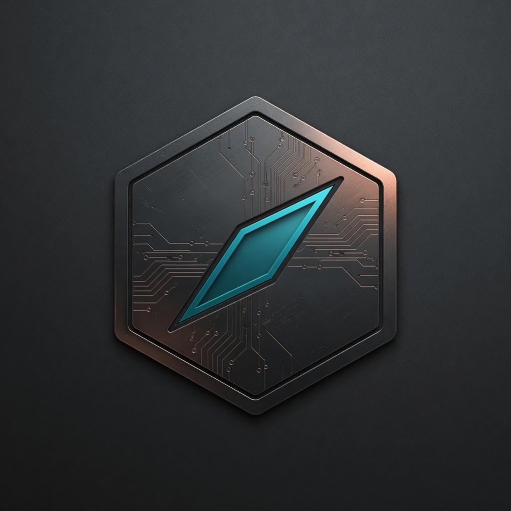
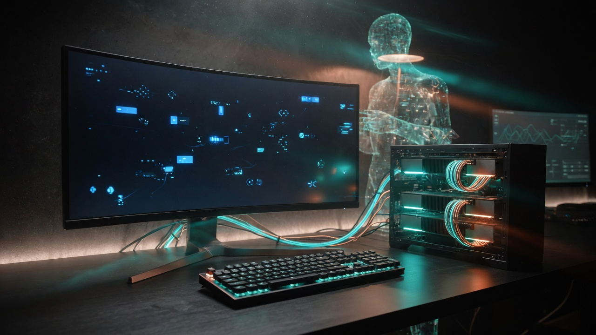
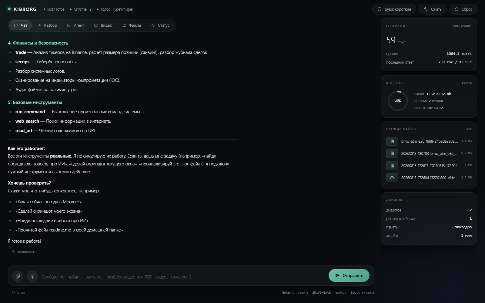
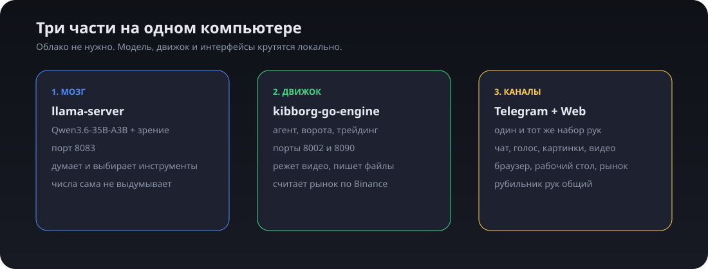
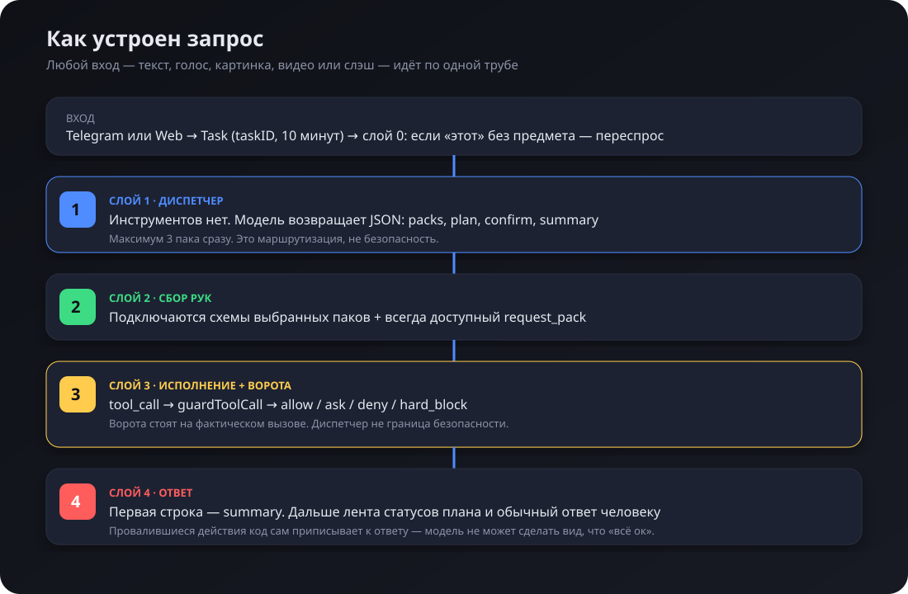
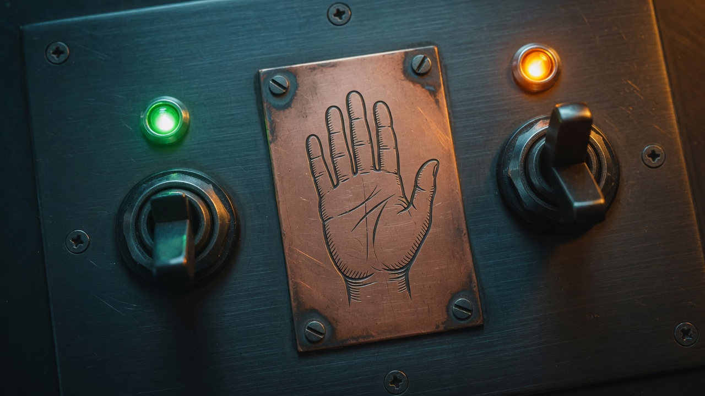

<p align="center">
  
</p>

<h1 align="center">Kibborg</h1>

<p align="center">
  <strong>Локальный ИИ-агент для Windows.</strong><br>
  Живёт на вашем компьютере, а не в облаке.<br>
  Пишет в Telegram и в браузерной панели. Видит экран, кликает в Chrome,<br>
  разбирает видео, считает рынок по настоящим свечам Binance.<br>
  Сам снимает железо и ставит GGUF-модель под ваши карты.
</p>

<p align="center">
  
  
  
  
</p>

<p align="center">
  
</p>

---

## За 30 секунд

Kibborg — это не «ещё один чат с нейросетью». Это **агент с руками**.

Вы пишете обычным языком: «что сегодня по битку», «сделай скриншот экрана», «разбери это видео и найди проект на GitHub», «открой блокнот и напиши список». Агент сам выбирает инструменты, спрашивает подтверждение на опасное и отвечает по делу.

Два лица, одно ядро:

| | Telegram | Локальная панель |
|---|---|---|
| Адрес | ваш бот | [http://127.0.0.1:8090](http://127.0.0.1:8090) |
| Кто пользуется | вы с телефона | вы за этим компьютером |
| Возможности | те же | те же |

Модель крутится **у вас**. Токен OpenAI не нужен. Интернет нужен модели только когда вы просите поискать в сети, скачать видео или взять свечи Binance.

<p align="center">
  
</p>

---

## Оглавление

1. [Что умеет](#что-умеет)
2. [Как это устроено](#как-это-устроено)
3. [Паки инструментов](#паки-инструментов)
4. [Безопасность и «длина рук»](#безопасность-и-длина-рук)
5. [Что нужно перед установкой](#что-нужно-перед-установкой)
6. [Установка с нуля](#установка-с-нуля)
7. [Скачать модель](#скачать-модель)
8. [Дополнительные модули](#дополнительные-модули)
9. [Настройки `settings.ini`](#настройки-settingsini)
10. [Первый запуск](#первый-запуск)
11. [Как пользоваться](#как-пользоваться)
12. [Команды Telegram](#команды-telegram)
13. [Веб-панель](#веб-панель)
14. [Железо и скорость](#железо-и-скорость)
15. [Структура репозитория](#структура-репозитория)
16. [Сборка и разработка](#сборка-и-разработка)
17. [Если что-то не работает](#если-что-то-не-работает)
18. [Что специально не лежит в GitHub](#что-специально-не-лежит-в-github)

---

## Что умеет

| Возможность | Как пользоваться |
|---|---|
| Обычный чат с локальной LLM | Пишите текстом. Голосовое в Telegram или кнопка 🎙 в вебе |
| Зрение | Пришлите картинку. Агент опишет и поймёт, что на ней |
| Разбор торгового графика | `/chart` + скрин. **Цены берутся с Binance**, не с картинки |
| Разбор тикера | `/analyze BTC` или вкладка «Разбор» (скоринг + алгоритм Герчика) |
| Тест железа | `/hw` или вкладка «Модели» — сокеты, ядра, потоки, RAM, каждая карта, VRAM, CUDA |
| Каталог и скачивание модели | `/models` или вкладка «Модели»: Hugging Face GGUF, фильтр как в LM Studio, посадка GPU / гибрид / CPU |
| Поиск в интернете | «что сегодня по BTC?», «найди статьи про…» |
| Живой Chrome | вкладки, чтение страницы, клик по надписи, формы, скрин вкладки |
| Настоящий рабочий стол Windows | скрин экрана, окна, мышь, клавиатура, процессы, буфер |
| Файлы и терминал | читать/писать/удалять, PowerShell |
| Видео любой длины | пришлите ролик или ссылку — речь в текст, кадры в описание |
| PDF и сканы | пришлите `.pdf` или «прочитай D:\акт.pdf» — текстовый слой, иначе OCR |
| Скачать ролик | ссылка YouTube / Instagram / TikTok / X или `/download` |
| Журнал сделок | `/log`, `/journal`, `/close`, `/size` |
| Разбор логов и IOC | `/logs`, `/scan`, `/audit` |
| Память между сессиями | SQLite + опциональные эмбеддинги |
| Озвучить ответ | кнопка «Озвучить» / `/speak`; тумблер «всегда» = `/tts auto`. Qwen3-TTS 0.6B на GPU (Serena) |
| Остановить задачу | `/stop` или кнопка ⏹ — сразу, не через две минуты |
| Подтвердить опасное | «да» / «нет» в Telegram, кнопки ✅ / 🚫 в вебе |

Инвариант проекта, его нельзя ломать:

> **Модель не выдумывает числа.** Цены, скоры, риск, размер позиции считает детерминированный Go-код по свечам Binance. LLM только объясняет уже посчитанное.

---

## Как это устроено

Три процесса на одном ПК:

<p align="center">
  
</p>

| Часть | Что это | Порт |
|---|---|---|
| **Мозг** | `llama-server` + GGUF-модель Qwen | `8083` |
| **Движок** | один бинарник `kibborg-go-engine.exe` | `8002` (API) и `8090` (панель) |
| **Каналы** | Telegram-бот внутри того же exe + веб-панель | — |

Модель **не** входит в этот репозиторий. Её скачивают отдельно (~20 ГБ). Движок без модели — это пустой пульт.

### Слои агента

Любой запрос — текст, голос, слэш, картинка, видео — идёт по **одной трубе**.

<p align="center">
  
</p>

```text
вход
  /stop и /hands обрабатываются ДО очереди
  голос  → распознавание → текст
  картинка → зрение БЕЗ инструментов → текст
  видео    → речь + кадры → текст   (ещё до диспетчера)
        ↓
Task { taskID, канал, 10 минут на задачу }
        ↓
СЛОЙ 0   «этот / такая» без предмета → переспросить, не угадывать
СЛОЙ 1   диспетчер без тулов → JSON { packs, plan, confirm, summary }
СЛОЙ 2   схемы выбранных паков + всегда доступный request_pack
СЛОЙ 3   tool_call → ворота → allow / ask / deny / hard_block
СЛОЙ 4   summary первой строкой, план лентой статусов, ответ человеку
```

Ключевые файлы, если полезете в код:

| Файл | Слой |
|---|---|
| `engine-go/referent.go` | слой 0 — «указание без предмета» |
| `engine-go/dispatcher.go` | слой 1 |
| `engine-go/packs.go` | слой 2 |
| `engine-go/agent_loop.go` | слои 3–4 |
| `engine-go/guard.go` | ворота на каждом tool-call |
| `engine-go/task.go` | задача, реестр, журналы |
| `engine-go/pending.go` | подтверждения «да / нет» |
| `engine-go/handsmode.go` | рубильник короткие / длинные руки |

Диспетчер — это **удобство**, не охрана. Охрана стоит на фактическом вызове инструмента.

---

## Паки инструментов

Диспетчер выдаёт **не больше трёх паков** на задачу. Если в процессе не хватило — модель просит ещё через `request_pack` (максимум 3 дозапроса).

| Пак | Что внутри | Когда берётся |
|---|---|---|
| `chat` | только `request_pack` | болтовня, «помнишь?» |
| `web` | поиск, `read_url`, HTTP, GitHub, субтитры YouTube | новости, факты, «что сейчас» |
| `browser.read` | вкладки, `open_url`, текст/DOM/сеть, скрин вкладки | «что на открытой странице» |
| `browser.act` | клик, ввод, скролл, формы, upload, drag | «нажми», «заполни» |
| `console` | `run_command` | PowerShell / команды |
| `files` | чтение, запись, список, mkdir, удаление | «сохрани в файл» |
| `system` | экран Windows, окна, клавиатура, мышь, процессы | «скриншот рабочего стола» |
| `media` | скачать / разобрать / нарезать видео | ссылка или ролик |
| `trade` | тикер, размер позиции, журнал | «разбери ETH», «залогируй лонг» |
| `secops` | логи, IOC, хеш и энтропия файла | «проверь этот лог» |

Два скриншота, которые нельзя путать:

- `capture_screen` из пака `system` — **настоящий монитор Windows**.
- `capture_screenshot` из `browser.read` — **только вкладка Chrome**.

Клики в браузере идут **по надписи** (`text=Войти`) настоящим событием мыши. Синтетический `el.click()` живые сайты часто игнорируют.

Видео — это не «модель для видео». `ffmpeg` режет ролик на то, что движок уже умеет: речь → распознавание, кадры → зрение. Длина упирается в диск, не в окно контекста.

---

## Безопасность и «длина рук»

<p align="center">
  
</p>

Недостижимых действий нет. Меняется только то, **спросят ли вас**.

| | Режим `safe` (короткие, по умолчанию) | Режим `full` (длинные) |
|---|---|---|
| Рутина (`dir`, `git status`, запись в рабочие папки) | сразу | сразу |
| Рискованное (удаление вне allowlist, правка `settings.ini`, `.git`) | спрашивает «да / нет» | делает молча |
| Ядерное (`format`, `diskpart`, `bcdedit`, выключение ПК, снос корня диска) | отказ | спрашивает **один раз** |
| Деньги (`transfer` / `withdraw` / `place_order`) | спрашивает | спрашивает |

Переключение:

- Telegram: `/hands` или кнопки в `/menu`
- Веб: тумблер «руки» в шапке панели

Один файл на оба канала: `engine-go/runtime/hands_mode.json`. В `settings.ini` режим **не пишется** — иначе тумблер сработал бы только после перезапуска.

Полный терминал и файлы доступны только:

- в Telegram — если ваш id указан в `TELEGRAM_ID`;
- в вебе — только с `127.0.0.1`.

Чужая машина по сети панель не откроет. Новые `/api/*` ходят через `sameOriginGuard`.

---

## Что нужно перед установкой

### Железо

Рекомендуемая сборка, на которой проект реально крутится:

| | Рекомендация |
|---|---|
| ОС | Windows 10 / 11 x64 |
| GPU | **2× RTX 3060 12 ГБ** (или одна карта ≥ 20 ГБ) |
| RAM | 64 ГБ и больше (на референсе ~176 ГБ) |
| Диск | SSD / NVMe, свободно **≥ 40 ГБ** (модель ~20 ГБ + видео + кэш) |
| CPU | современный многоядерный; на референсе 2× Xeon |

Можно и слабее — но тогда нужна модель поменьше и меньший контекст. См. [железо](#железо-и-скорость).

### Программы, без которых стек не встанет

Это **обязательный** минимум:

| Что | Зачем | Куда качать |
|---|---|---|
| **Git** | скачать этот репозиторий | [git-scm.com](https://git-scm.com/download/win) |
| **Go 1.26+** | собрать движок | [go.dev/dl](https://go.dev/dl/) |
| **NVIDIA-драйвер** | чтобы модель жила на видеокартах | [nvidia.com/drivers](https://www.nvidia.com/Download/index.aspx) |
| **llama.cpp / `llama-server.exe`** | крутит GGUF-модель | [релизы llama.cpp](https://github.com/ggml-org/llama.cpp/releases) — берите `win-cuda` |
| **Модель Qwen3.6-35B-A3B** | сам «мозг» | раздел [Скачать модель](#скачать-модель) |

### Программы, без которых часть функций молчит

Стек запустится и без них. Конкретные руки просто скажут «нет».

| Что | Без этого не работает | Куда качать |
|---|---|---|
| **Google Chrome** | живой браузер агента | [google.com/chrome](https://www.google.com/chrome/) |
| **FFmpeg + ffprobe** | голос, разбор и склейка видео | `winget install Gyan.FFmpeg` |
| **Poppler** | текстовый слой PDF (`pdftotext` / `pdftoppm`) | `winget install oschwartz10612.Poppler` |
| **Tesseract OCR** | распознавание сканов (rus+eng) | `winget install UB-Mannheim.TesseractOCR` |
| **yt-dlp** | скачивание YouTube / Instagram / TikTok | `pip install -U yt-dlp` |
| **Python 3.11+** | `huggingface-cli`, `yt-dlp`, опциональный Agent Reach | [python.org](https://www.python.org/downloads/) |
| **TypeWhisper** | быстрый голос (рекомендуется) | [TypeWhisper для Windows](https://github.com/TypeWhisper/typewhisper-win) |
| **Qwen3-TTS 0.6B** | озвучка ответов, GPU (Serena, RU/EN) | `engine-go\tts_server\install.cmd` |
| **whisper.cpp** | запасной голос, если TypeWhisper не запущен | [whisper.cpp](https://github.com/ggml-org/whisper.cpp) |
| **Telegram-бот** | канал с телефона | [@BotFather](https://t.me/BotFather) |

---

## Установка с нуля

Делайте **по порядку**. Если пропустите шаг — на запуске будет непонятная ошибка.

### Шаг 1. Скачать код

Откройте PowerShell:

```powershell
git clone https://github.com/Ydjin1984/Kibborg_AI_Assistant.git
cd Kibborg_AI_Assistant
```

Или скачайте ZIP с GitHub → «Code → Download ZIP» и распакуйте, например, в `D:\Kibborg_AI_Assistant`.

### Шаг 2. Поставить Go

1. Скачайте установщик с [go.dev/dl](https://go.dev/dl/) (Windows, amd64).
2. Установите, **поставьте галочку Add to PATH**.
3. Закройте и заново откройте PowerShell.
4. Проверка:

```powershell
go version
```

Должно быть `go1.26` или новее. Если «не является командой» — PATH не подхватился, перелогиньтесь в Windows.

### Шаг 3. Поставить `llama-server` с CUDA

1. Откройте [релизы llama.cpp](https://github.com/ggml-org/llama.cpp/releases).
2. Скачайте архив вида `llama-<версия>-bin-win-cuda-12.4-x64.zip` (или новее).
3. Распакуйте, например, в `D:\llama.cpp\cuda-bin\`.
4. В этой папке должны лежать:
   - `llama-server.exe`
   - `ggml-cuda.dll`, `cublas*.dll` и остальные DLL рядом с exe.

**Не разлучайте exe и DLL.** Движок ищет библиотеки в той же папке, где лежит `llama-server.exe`.

Проверка:

```powershell
D:\llama.cpp\cuda-bin\llama-server.exe --help
```

Если Windows ругается на отсутствие `cublas64_12.dll` — вы скачали не CUDA-сборку или не ту версию CUDA.

CPU-сборка тоже запустится, но 35B-модель на процессоре отвечает минутами. Для агента это почти непригодно.

### Шаг 4. Скачать модель

См. следующий раздел. После скачивания у вас должно быть:

```text
engine-go\models\brain\Qwen3.6-35B-A3B\
    Qwen3.6-35B-A3B-UD-IQ4_XS.gguf     (~19.7 ГБ)
    mmproj-BF16.gguf                   (зрение)
```

### Шаг 5. Создать `settings.ini`

```powershell
cd engine-go
copy settings.ini.example settings.ini
notepad settings.ini
```

Обязательно поправьте четыре строки:

```ini
MODEL_PATH=models\brain\Qwen3.6-35B-A3B\Qwen3.6-35B-A3B-UD-IQ4_XS.gguf
MMPROJ_PATH=models\brain\Qwen3.6-35B-A3B\mmproj-BF16.gguf
LLAMA_SERVER=D:\llama.cpp\cuda-bin\llama-server.exe
TELEGRAM_TOKEN=123456:ABC...
TELEGRAM_ID=123456789
```

Как получить токен и свой id — в [настройках](#настройки-settingsini).

Без `TELEGRAM_ID` бот в Telegram будет **обычным чатом без инструментов**. Агент (файлы, терминал, браузер, рабочий стол) включится только для id из списка.

### Шаг 6. Поставить дополнительные модули

Минимум, который стоит поставить сразу:

```powershell
winget install Gyan.FFmpeg
pip install -U yt-dlp huggingface_hub
```

Chrome — если ещё нет. TypeWhisper — если хотите голос. Подробности в [дополнительных модулях](#дополнительные-модули).

### Шаг 7. Собрать движок

Дважды кликните `engine-go\Menu.cmd` → пункт **4. Собрать**.

Или из консоли:

```powershell
cd engine-go
.\build.cmd
```

`build.cmd` делает не «голый» `go build`, а полный конвейер:

1. `gofmt -l .` — неформатированный код = отказ
2. `go vet ./...`
3. `staticcheck ./...` (поставится сам, если нет)
4. `go build -buildvcs=false -o kibborg-go-engine.exe .`

Первая сборка качает зависимости Go и `staticcheck` — подождите. В конце должно появиться `engine-go\kibborg-go-engine.exe`.

### Шаг 8. Запустить

- `Start.cmd` в корне репозитория (или `engine-go\Start.cmd`) — **одна команда на весь стек**: панель, мозг, Qwen3-TTS. Мозг грузится 1–5 минут или переиспользует уже тёплый `llama-server`.
- `Stop.cmd` в корне (или `engine-go\Stop.cmd`) — **одна команда выключить всё**: панель, мозг, озвучку, whisper. TypeWhisper в трее не трогает.
- `engine-go\Menu.cmd` → **5** старт, **6** стоп.

После старта:

1. Откройте [http://127.0.0.1:8090](http://127.0.0.1:8090) — в шапке чип «мозг» должен стать зелёным. Если модели ещё нет, чип будет красным: вкладка **Модели** работает и без мозга — снимите железо и скачайте GGUF, затем Stop → Start.
2. В Telegram напишите боту `/start`, затем `привет`.

Готово. Дальше — [первый запуск](#первый-запуск) и [как пользоваться](#как-пользоваться).

---

## Скачать модель

**Модели в GitHub нет и не будет.** Файл ~20 ГБ, это нормально.

Самый прямой путь — **вкладка «Модели»** в панели (`http://127.0.0.1:8090`). Кнопка «Тест железа» снимает CPU, RAM и карты; каталог Hugging Face сразу помечает кванты: целиком на GPU, гибрид GPU+CPU или только CPU. «Авто GPU» оставляет те, что точно лягут в сумму VRAM. Скачивание кладёт файл в `models/brain/` и прописывает `MODEL_PATH` в `settings.ini`. Работающий `llama-server` не гасится — после скачивания Stop → Start.

В Telegram то же самое: `/hw` — отчёт по железу, `/models qwen` — поиск, `/models get owner/repo file.gguf` — скачать.

Ниже — ручные способы, если панель ещё не поднята.

### Рекомендуемая (по умолчанию)

**Qwen3.6-35B-A3B** в квантизации Unsloth `UD-IQ4_XS` + проектор зрения.

| Файл | Зачем | Размер |
|---|---|---|
| [Qwen3.6-35B-A3B-UD-IQ4_XS.gguf](https://huggingface.co/unsloth/Qwen3.6-35B-A3B-GGUF/resolve/main/Qwen3.6-35B-A3B-UD-IQ4_XS.gguf?download=true) | сам мозг | ~19.7 ГБ |
| [mmproj-BF16.gguf](https://huggingface.co/unsloth/Qwen3.6-35B-A3B-GGUF/resolve/main/mmproj-BF16.gguf?download=true) | зрение (картинки, кадры видео, графики) | отдельно |

Страница модели: [unsloth/Qwen3.6-35B-A3B-GGUF](https://huggingface.co/unsloth/Qwen3.6-35B-A3B-GGUF).

### Способ А. Пункт меню (проще всего)

`engine-go\Menu.cmd` → **1. Скачать рекомендованную модель**.

Он сам поставит `huggingface_hub` и скачает оба файла в `engine-go\models\brain\Qwen3.6-35B-A3B\`.

### Способ Б. Команда вручную

```powershell
cd engine-go
pip install -U "huggingface_hub[cli]"

hf download unsloth/Qwen3.6-35B-A3B-GGUF `
  Qwen3.6-35B-A3B-UD-IQ4_XS.gguf mmproj-BF16.gguf `
  --local-dir .\models\brain\Qwen3.6-35B-A3B
```

Если `hf` «не является командой»:

```powershell
python -m huggingface_hub.commands.huggingface_cli download unsloth/Qwen3.6-35B-A3B-GGUF Qwen3.6-35B-A3B-UD-IQ4_XS.gguf mmproj-BF16.gguf --local-dir .\models\brain\Qwen3.6-35B-A3B
```

### Способ В. Браузер

Скачайте две ссылки выше и положите файлы **ровно** сюда:

```text
engine-go\models\brain\Qwen3.6-35B-A3B\Qwen3.6-35B-A3B-UD-IQ4_XS.gguf
engine-go\models\brain\Qwen3.6-35B-A3B\mmproj-BF16.gguf
```

Имена файлов должны совпасть с `MODEL_PATH` и `MMPROJ_PATH` в `settings.ini`.

### Опционально: эмбеддинги для умной памяти

Без этой модели память работает поиском по словам. С ней — по смыслу.

Пример (любая маленькая embedding-модель в GGUF, 100–500 МБ):

```ini
EMBED_MODEL=models\embed\bge-m3-Q4_K_M.gguf
PORT_EMBED=8082
```

Пустая `EMBED_MODEL=` — нормально, память всё равно включена.

### Опционально: запасной Whisper

Если не ставите TypeWhisper, можно поднять `whisper.cpp`:

```ini
WHISPER_SERVER=D:\whisper.cpp\whisper-server.exe
WHISPER_MODEL=models\whisper\ggml-large-v3-turbo.bin
PORT_WHISPER=8081
```

Модели Whisper: [ggerganov/whisper.cpp на Hugging Face](https://huggingface.co/ggerganov/whisper.cpp). Для русского берите `large-v3-turbo` или `large-v3`.

---

## Дополнительные модули

Ставьте только то, чем будете пользоваться. Каждая строка — отдельная рука агента.

### 1. FFmpeg — голос и видео

Без `ffmpeg` / `ffprobe` не работают: голосовые, разбор ролика, склейка скачанного видео.

```powershell
winget install Gyan.FFmpeg
```

Проверка (новое окно терминала):

```powershell
ffmpeg -version
ffprobe -version
```

Если команда не находится — допишите полный путь в `settings.ini`:

```ini
FFMPEG=C:\ffmpeg\bin\ffmpeg.exe
```

`ffprobe` ищется рядом с `ffmpeg`, отдельно указывать не нужно.

### 2. yt-dlp — скачивание видео

```powershell
pip install -U yt-dlp
yt-dlp --version
```

Агент зовёт `yt-dlp` из `PATH`. Поддерживаются YouTube, Instagram, TikTok, X и всё, что умеет yt-dlp.

Некоторые сайты требуют свежий бинарь. Если «HTTP 403» — обновите: `pip install -U yt-dlp`.

### 3. Google Chrome — живой браузер

Агент **не запускает** свой Chrome. Он подключается к уже открытому окну по Chrome DevTools Protocol, порт `9222`.

Правильно: `engine-go\Menu.cmd` → **7. Запустить Chrome с отладкой**.

Это поднимает **отдельный профиль** `engine-go\runtime\chrome-debug`. Если просто открыть обычный Chrome, флаг `--remote-debugging-port` часто молча не встаёт.

Проверка: в адресной строке откройте [http://127.0.0.1:9222/json/version](http://127.0.0.1:9222/json/version). Должен прийти JSON. Если страница не открывается — агент честно скажет «chrome не отвечает».

Вкладки, с которыми должен работать агент, открывайте **в этом** окне Chrome.

### 4. TypeWhisper — голос (рекомендуется)

Два режима одной программы:

| Режим | Зачем |
|---|---|
| Системная диктовка | речь → текст в любой программе (терминал, браузер) |
| HTTP API на порту `8978` | Telegram voice и кнопка 🎙 в веб-панели Kibborg |

Установка:

1. Скачайте релиз: [TypeWhisper for Windows](https://github.com/TypeWhisper/typewhisper-win/releases).
2. Установите, дождитесь загрузки модели.
3. Settings → Advanced → **API Server ON**, порт **8978**.
4. Модель: Whisper Large V3 Turbo (качество + скорость, ru/en).

В `settings.ini` можно ничего не писать:

```ini
TYPEWHISPER_URL=
TYPEWHISPER_TOKEN=
```

Пустое значение = автопоиск (`%LOCALAPPDATA%\TypeWhisper\api-discovery.json`, затем `:8978`).

`TYPEWHISPER_URL=off` полностью выключает TypeWhisper.

Проверка:

```powershell
Invoke-RestMethod http://127.0.0.1:8978/v1/status
```

Порядок распознавания в Kibborg:

1. TypeWhisper `POST /v1/transcribe/local-file`
2. TypeWhisper `POST /v1/transcribe`
3. whisper.cpp, если заданы `WHISPER_*`

Подробности — `engine-go/TYPEWHISPER.md`.

### 5. Qwen3-TTS — озвучка ответов

Чтобы бот **говорил**, а не только слушал:

```powershell
cd engine-go\tts_server
.\install.cmd
```

Движок сам поднимает `tts_server\server.py` на `127.0.0.1:7788` (Qwen3-TTS 0.6B CustomVoice на GPU, по умолчанию `TTS_GPU=1` = RTX 3060, голос Serena). Первая загрузка весов ~2 ГБ. В панели — кнопка «Озвучить» и тумблер «всегда / по запросу». В Telegram: `/tts auto`, `/tts ask`, `/speak`.

Режим тумблера живёт в `runtime/tts_mode.json`, не в `settings.ini`.

### 5. Poppler + Tesseract — PDF и сканы

Без них агент не прочитает PDF: ни текстовый слой, ни скан.

```powershell
winget install oschwartz10612.Poppler
winget install UB-Mannheim.TesseractOCR
```

Порядок разбора: текстовый слой (`pdftotext`) → OCR страницы (`tesseract`) → зрение только там, где OCR вернул пустоту.

Русский пакет Tesseract из коробки часто отсутствует. Без него на русском скане будет латинская каша вместо кириллицы. Положите `rus.traineddata` в `engine-go\runtime\tessdata\` (качается с [tesseract-ocr/tessdata](https://github.com/tesseract-ocr/tessdata)).

В `settings.ini` пути обычно пустые — ищутся сами:

```ini
POPPLER_DIR=
TESSERACT=
TESSDATA_DIR=
```

Большой справочник целиком не пересказывается: агент ищет по нему (`find=`) и читает нужные страницы.

### 6. Python + Agent Reach (по желанию)

Встроенный поиск (`web_search`, `read_url`, `semantic_search`, `youtube_transcript`) **Python не требует**.

`agent-reach` даёт дополнительные CLI (twitter, gh, mcporter, bili…):

```powershell
pip install agent-reach
agent_reach_doctor
```

После этого в паке `web` появляются `agent_reach*` и `run_command` через upstream CLI.

### 7. Telegram-бот

1. Откройте [@BotFather](https://t.me/BotFather).
2. `/newbot` → имя → username (должен кончаться на `bot`).
3. Скопируйте токен вида `123456789:AAH...` в `TELEGRAM_TOKEN=`.
4. Узнайте свой числовой id: напишите [@userinfobot](https://t.me/userinfobot) или [@getmyid_bot](https://t.me/getmyid_bot).
5. Вставьте в `TELEGRAM_ID=`. Несколько id — через запятую.

Без своего id в `TELEGRAM_ID` бот вам ответит, но **руки не даст**.

---

## Настройки `settings.ini`

Файл лежит в `engine-go\settings.ini`. Шаблон — `settings.ini.example` (он в git). Сам `settings.ini` в git **не попадает**: там токен бота.

После любой правки: Stop → Start (или Меню → 6, затем 5). Мозг в VRAM можно не гасить, если меняли только токен / руки / порты веба — но проще перезапустить всё.

### Мозг

| Ключ | Пример | Смысл |
|---|---|---|
| `MODEL_PATH` | `models\brain\Qwen3.6-35B-A3B\....gguf` | какой GGUF грузить (ещё и вкладка «Модели») |
| `MMPROJ_PATH` | тот же каталог `\mmproj-BF16.gguf` | зрение; `auto` = рядом с моделью; пусто = только текст |
| `LLAMA_SERVER` | `D:\llama.cpp\cuda-bin\llama-server.exe` | путь к exe |
| `PORT_BRAIN` | `8083` | не занимайте 8080 — часто занят |
| `LLAMA_CTX_SIZE` | `32768` | окно контекста. На двух 12 ГБ стабильно 32K |
| `LLAMA_GPU_LAYERS` | `99` | все слои на GPU. При OOM снижайте до 80 |
| `LLAMA_TENSOR_SPLIT` | `0.35,0.65` | две карты: меньше на ту, где монитор |
| `LLAMA_DEVICE` | *(пусто)* | пусто + tensor-split = обе карты. `CUDA0` = одна |
| `LLAMA_MAIN_GPU` | `0` | куда класть KV-кэш |
| `LLAMA_CACHE_TYPE_K/V` | `q8_0` | экономит VRAM на 12 ГБ |
| `LLAMA_THREADS` | `28` | потоки CPU |
| `LLAMA_PARALLEL` | `1` | **не ставьте 2 при 32K** — слоты делят контекст пополам |
| `LLAMA_REASONING` | `off` | `on` = длинные «размышления» Qwen, агент тупит |

### Каналы

| Ключ | Смысл |
|---|---|
| `TELEGRAM_TOKEN` | токен от BotFather |
| `TELEGRAM_ID` | кому можно агента. Пусто = чат без рук |
| `PORT_WEB` | панель, по умолчанию `8090`. `0` = выключить |
| `PORT_ENGINE` | внутренний HTTP, `8002` |

### Руки

| Ключ | Смысл |
|---|---|
| `AGENT_HANDS_ROOTS` | доп. каталоги, где можно писать/удалять без вопроса. Разделитель `;` или `,` |

Проект, Рабочий стол и `engine-go\runtime` разрешены всегда. Режим `safe`/`full` сюда **не пишется**.

### Голос и видео

| Ключ | Смысл |
|---|---|
| `TYPEWHISPER_URL` | пусто = авто; `off` = не использовать |
| `TYPEWHISPER_TOKEN` | если в TypeWhisper включили токен |
| `WHISPER_SERVER` / `WHISPER_MODEL` | запасной whisper.cpp |
| `PORT_WHISPER` | `8081` |
| `FFMPEG` | пусто = искать в PATH |
| `POPPLER_DIR` | каталог `pdftotext` / `pdftoppm`; пусто = PATH |
| `TESSERACT` | путь к `tesseract.exe`; пусто = PATH |
| `TESSDATA_DIR` | языки OCR; пусто = `runtime/tessdata` |

### Память и трейдер

| Ключ | Смысл |
|---|---|
| `MEMORY_ENABLED` | `true` по умолчанию |
| `EMBED_MODEL` | пусто = память по словам |
| `PORT_EMBED` | `8082` — отдельный llama-server для эмбеддингов |
| `TRADE_BALANCE` | размер счёта в USDT для `/size` |
| `TRADE_RISK_PCT` | риск на сделку, `%` |
| `TRADE_LEVERAGE` | плечо (1 = спот) |
| `STOP_BRAIN_ON_EXIT` | `false` = модель остаётся тёплой в VRAM между перезапусками бота |

---

## Первый запуск

1. `engine-go\Start.cmd`.
2. Подождите. Первая загрузка модели в две 3060 — **1–5 минут**. Смотрите `nvidia-smi -l 1`: VRAM должен заполниться.
3. Откройте [http://127.0.0.1:8090](http://127.0.0.1:8090).
   - «мозг готов» — зелёный;
   - «Chrome» — зелёный, только если запущен пункт меню 7;
   - «голос» — зелёный, если TypeWhisper в трее.
4. Telegram → `/start` → `привет`.
5. Должен прийти ответ. Если тишина — смотрите окно `Start.cmd` и `engine-go\runtime\`.

Минимальная проверка агента:

| Напишите | Что должно произойти |
|---|---|
| `привет` | обычный ответ, пак `chat` |
| `что сегодня по BTC?` | поиск + чтение ссылок, не выдуманные цифры |
| `разбери ETH` | детерминированный отчёт Binance |
| `сделай скриншот экрана` | реальный монитор, не вкладка |
| голосовое «привет» | «🎙 Распознал …» и ответ |

Если что-то из таблицы не сошлось — смотрите `engine-go/runtime/tasks.jsonl` и раздел [Если что-то не работает](#если-что-то-не-работает).

---

## Как пользоваться

Пишите **как человеку**. Слэши — ярлыки, не обязаловка.

Примеры, которые агент понимает сам:

- «что сегодня по BTC?»
- «сохрани это в файл на рабочий стол»
- «открой блокнот и напиши список покупок»
- «какой заголовок на открытой вкладке?»
- «нажми Войти»
- «разбери D:\видео\урок.mp4 и найди этот проект на гитхабе»
- просто ссылка на YouTube — скачает
- картинка графика + слово `/chart` — разберёт, цены возьмёт с рынка

Остановить текущую работу: `/stop` или ⏹. Сработает за секунду, даже посреди `Start-Sleep`.

Опасный шаг в режиме `safe`: бот спросит. Ответьте `да` или `нет`. Пока ждёт — можно писать `/hands` и `/stop`, бот не завис.

Сжать длинный диалог, не выкидывая суть: `/compact` или кнопка «Сжать». Старое пересказывается, свежее остаётся дословно.

Полный сброс памяти чата: `/reset`.

---

## Команды Telegram

Кнопка **☰** слева от поля ввода показывает этот список. `/menu` открывает живую панель с тумблером рук.

| Команда | Что делает |
|---|---|
| `/menu` | панель: руки, стоп, сжатие, статус |
| `/hands` | показать режим; `/hands safe` и `/hands full` — переключить |
| `/stop` | убить текущую задачу |
| `/compact` | сжать историю в сводку |
| `/reset` | очистить контекст и долговременную память |
| `/agent` / `/browser` | явная задача агенту |
| `/analyze BTC` | разбор тикера по Binance |
| `/hw` | тест железа: сокеты, ядра, потоки, RAM, GPU, VRAM |
| `/models [запрос]` | каталог GGUF под ваше железо; `/models get owner/repo file.gguf` — скачать |
| `/chart` | затем пришлите скрин графика |
| `/size BTC entry=50000 stop=49000 risk=1.5` | размер позиции |
| `/log` | записать сделку |
| `/journal` | статистика журнала |
| `/close <id> <цена>` | закрыть сделку |
| `/download <url>` | скачать видео |
| `/logs` | разбор логов (свои или путь) |
| `/scan <текст>` | поиск IOC |
| `/audit` | хеш и энтропия файла |
| `/tts` | озвучка: `/tts auto` всегда, `/tts ask` по запросу |
| `/speak` | прочитать последний ответ голосом |
| `/help` | короткая справка |

Голос, фото, кружок, ролик, документ, голая ссылка на видео — всё это тоже вход. Отдельная команда не нужна.

Лимит Telegram на файл боту — **20 МБ**. Большой ролик присылайте ссылкой или пишите путь на диске: `разбери D:\видео\big.mp4`.

---

## Веб-панель

Адрес только с этого компьютера: [http://127.0.0.1:8090](http://127.0.0.1:8090).

| Вкладка | Аналог в Telegram |
|---|---|
| Чат | обычные сообщения, вложения, голос |
| Разбор | `/analyze` — скоринг и сценарии лонга/шорта по Герчику |
| Агент | `/agent` / `/browser` |
| Видео | `/download` (разбор ролика — перетащите файл **в чат**) |
| Файлы | артефакты задач из `runtime/browser` |
| Модели | `/hw` + `/models` — тест железа, каталог Hugging Face, скачивание GGUF |
| Статус | чипы мозга / Chrome / голоса |

В шапке:

- тумблер рук (тот же, что `/hands`);
- Сжать = `/compact`;
- Сброс = `/reset`.

Справа — скорость генерации, кольцо контекста и свежие файлы. Стоп под полем ввода = `/stop`.

Подтверждение опасного шага — кнопки ✅ / 🚫 под сообщением.

---

## Железо и скорость

Референс: 2× RTX 3060 12 ГБ, tensor-split `0.35,0.65` (больше весов на свободную карту без монитора).

Замеренные числа на Qwen3.6-35B-A3B, контекст 32K:

| Метрика | Значение |
|---|---|
| Первый промпт исполнителя | 2 300–3 500 токенов |
| Обработка этого промпта | 1.3–2.0 с |
| Диспетчер | 1.6–2.8 с |
| Запас окна | многократный |

Следить за картами:

```powershell
nvidia-smi -l 1
```

| Симптом | Что делать |
|---|---|
| CUDA out of memory | `LLAMA_GPU_LAYERS=80` или `LLAMA_CTX_SIZE=16384` |
| Одна карта 100%, вторая пустая | `LLAMA_DEVICE` должен быть пустым, `LLAMA_TENSOR_SPLIT=0.35,0.65` |
| Ответ ползёт | не ставьте `LLAMA_PARALLEL=2` при 32K |
| После смены модели «старая» | Stop → Start, либо убейте `llama-server.exe` руками |

Если видеокарта одна и меньше 20 ГБ — на вкладке «Модели» нажмите «Авто GPU» и возьмите квант, который помечен «целиком на GPU» (часто Qwen 8B / 14B). Агент будет слабее держать JSON диспетчера и длинные цепочки, но чат заработает. Можно и руками прописать новый `MODEL_PATH`.

CPU-only: формально возможно, практически для 35B — нет.

---

## Структура репозитория

```text
Kibborg_AI_Assistant/
├── README.md                 ← вы здесь
├── AGENTS.md                 ← правила для тех, кто дописывает код
├── docs/images/              ← картинки этой инструкции
└── engine-go/                ← весь продукт
    ├── Menu.cmd              ← меню: модель, настройки, сборка, старт
    ├── Start.cmd / Stop.cmd
    ├── build.cmd             ← единственный правильный способ собрать
    ├── settings.ini.example  ← скопировать в settings.ini
    ├── main.go               ← Telegram + очередь
    ├── webui.go + web/       ← панель http://127.0.0.1:8090
    ├── dispatcher.go         ← слой 1
    ├── packs.go              ← слой 2
    ├── agent_loop.go         ← слои 3–4
    ├── guard.go              ← ворота
    ├── system_tools.go       ← рабочий стол Windows
    ├── video*.go             ← слой видео
    ├── document.go           ← PDF: текстовый слой / OCR / зрение
    ├── hardware.go           ← тест железа (CPU / RAM / GPU)
    ├── models_hub.go         ← каталог Hugging Face GGUF и скачивание
    ├── summarize.go          ← свёртка длинного текста
    ├── trading/              ← детерминированный рынок
    ├── browser/              ← Chrome CDP
    ├── journal/ memory/ secops/
    └── models/               ← СЮДА кладёте GGUF (в git не входит)
```

Журналы живой работы (не коммитятся):

| Файл | Что внутри |
|---|---|
| `engine-go/runtime/tasks.jsonl` | одна строка на задачу: вход, паки, шаги, исход |
| `engine-go/runtime/hands.jsonl` | почему инструмент разрешили / спросили / запретили |
| `engine-go/runtime/hands_mode.json` | текущий рубильник |
| `engine-go/runtime/memory.db` | долговременная память |
| `engine-go/runtime/journal.db` | журнал сделок |
| `engine-go/runtime/browser/` | скрины, скачанные видео, профиль Chrome |

---

## Сборка и разработка

Сборка **только** через `engine-go/build.cmd` (или Меню → 4, или автосборка в `Start.cmd`). Голый `go build` — разово, в пайплайн нельзя.

Перед коммитом:

```powershell
cd engine-go
.\build.cmd
go test ./...
```

Живой разбор видео (не гоняется в обычном CI):

```powershell
$env:KIBBORG_LIVE_MEDIA = "D:\путь\к\ролику.mp4"
go test ./... -run Live -count=1
```

Правило продукта: **всё, что появляется в Telegram, появляется в вебе — и наоборот.** Общее ядро, потом оба канала, потом справка `/start` и подсказка в UI. Подробно — [`AGENTS.md`](AGENTS.md).

---

## Если что-то не работает

| Симптом | Куда смотреть |
|---|---|
| Панель не открывается | запущен ли `Start.cmd`, не занят ли порт 8090 |
| «мозг» красный | `LLAMA_SERVER` и `MODEL_PATH` существуют? `nvidia-smi` видит карты? |
| Бот в Telegram молчит | токен верный? бот не заблокирован? смотрите окно Start |
| Отвечает, но «не могу открыть файл / консоль» | пустой `TELEGRAM_ID` — агент выключен |
| Chrome «не отвечает» | Меню → 7, не обычное окно Chrome. Проверьте `:9222/json/version` |
| Голос не распознаётся | TypeWhisper в трее, API ON, порт 8978 |
| Видео «нет ffmpeg» | `winget install Gyan.FFmpeg`, новое окно терминала |
| Скачивание 403 | `pip install -U yt-dlp` |
| Спрашивает подтверждение на ерунде | `/hands` — какой режим? строка в `runtime/hands.jsonl` называет правило |
| CUDA OOM | меньше слоёв или контекст 16K |
| Ответ содержит `run_command(...)` текстом | известное ограничение локальной модели (~1 из 3). Задача помечается failed, просто повторите |
| После рестарта «протухшее подтверждение» | так и должно: недоигранный «да/нет» не доигрывается вслепую |

Две команды, которые чинят половину вопросов «а что он сейчас делает»:

```powershell
Get-Content engine-go\runtime\tasks.jsonl -Tail 1 | ConvertFrom-Json | Format-List

$id = (Get-Content engine-go\runtime\tasks.jsonl -Tail 1 | ConvertFrom-Json).taskID
Get-Content engine-go\runtime\hands.jsonl | ConvertFrom-Json |
  Where-Object taskID -eq $id |
  Format-Table tool, decision, rule, status, reason -AutoSize
```

---

## Что специально не лежит в GitHub

| Не пушится | Почему |
|---|---|
| `engine-go/models/` | GGUF на десятки гигабайт, качается отдельно |
| `engine-go/settings.ini` | там токен бота |
| `engine-go/runtime/` | история чатов, память, журнал сделок, профиль Chrome, ваши видео |
| `*.exe` | собирается у вас через `build.cmd` |
| `*.log` | мусор запуска |

Если случайно закоммитили токен — **сразу** отзовите его у @BotFather (`/revoke`) и сделайте новый.

---

## Документы рядом

| Файл | Для кого |
|---|---|
| [`AGENTS.md`](AGENTS.md) | кто дописывает фичи: паритет Telegram ↔ Web |
| [`engine-go/SETUP_HARDWARE.md`](engine-go/SETUP_HARDWARE.md) | параметры llama-server под 2×3060 |
| [`engine-go/TYPEWHISPER.md`](engine-go/TYPEWHISPER.md) | голос |
| [`engine-go/GO_REFERENCE.md`](engine-go/GO_REFERENCE.md) | канон Go-движка |
| [`engine-go/browser/BROWSER_AGENT.md`](engine-go/browser/BROWSER_AGENT.md) | спецификация Chrome-агента |
| [`engine-go/settings.ini.example`](engine-go/settings.ini.example) | все ключи с комментариями |

---

<p align="center">
  <sub>Kibborg крутится у вас на столе. Модель ваша, руки ваши, подтверждение — тоже ваше.</sub>
</p>
